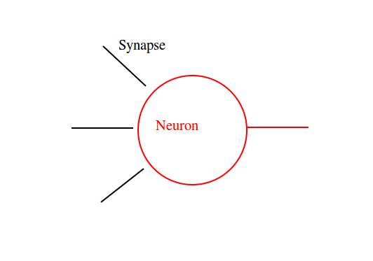
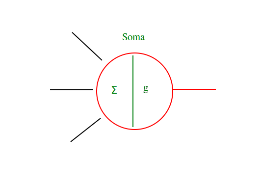
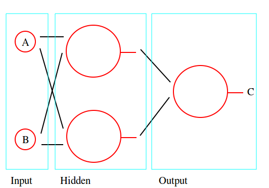
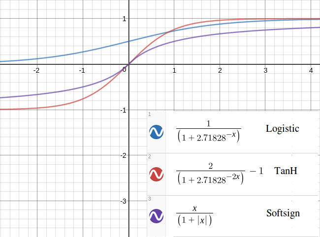

This project implements a neural network in c++, which is useful for some types of classification.

I was originally doing this in Python, while learning about making neural networks and how they
work, when it occurred to me that making this in Python was pointless because Python (although I
love that language) is unfortunately slow. So, I took this as a reason to learn c++, which I have
enjoyed learning.

###Compile

On a Linux system, do: `make` at your terminal.

My makefile is not the prettiest, but I can read it and I think it's OK for my first c++ project.

This project was made on a Linux system, and there's no plan to make sure it works in Windows or
Mac. Make a pull request if that's what you want.

###Usage

If you're missing permissions, do: `chmod +x bin/*`

When this project is finished, it will have two programs: `train` and `classify`. This is a WIP.

The `train` will allow you to train a neural network, and then dump all weights of all Synapses that
connect Neurons into a file.

You might use it like this:

    ./bin/train --structure 231 --training data/training/XnorGate --dump data/networks/231_XnorGate

The --options mean:

- structure - creates a network of 3 layers with 2 input, 3 hidden, 1 output Neurons
- training - the data to train the network. Should be documents and the labels, or categories, they
  map to
- dump - the save location for the finished state of the network

Next, the classify program:

    ./bin/classify --load data/networks/231_XnorGate --classify data/test/XnorGate --dump data/results/231_XnorGate

Similarly, these --options mean

- load - the network state that was saved, we can use to recreate a network
- classify - the data to test the network, to make sure it can classify (preferably unseen) documents
- dump - the location to save statistics about the training, so we can see if it was a success, or
  not

Each of these could be a separate `int main()` inside its own executable, and they could each
initialise a neural network to do their tasks.

###Tests

After compiling, these are found in bin/tests/, and can be run as executable files.

If you're missing permissions, do: `chmod +x bin/tests/*`

Then do `./bin/tests/integration`

I have been unable to mock objects in C++ so far, so there are no unit tests for functions that have
side effects.

###Discussion

To make an artificial neural network, it's helpful to think about the different elements of biological
neurons and networks.

Elements of (some) Neural Networks -

- Multipolar Neuron - an individual cell that communicates with other cells, with multiple
  Dendrites and multiple Axon Terminals.
- Soma - the body of the cell. This contains the nucleus and the decision process to send a signal to
other neurons.
- Axon - where a neuron outputs its own signal.
- Axon Terminal - each Axon has Terminals, which branch off (in a sense) to other Neurons' Dendrites.
- Dendrite - a neuron has many of these. Each Dendrite can be thought of as connecting to an Axon
- Terminal via a synapse.
- Synapse - the part that connects an Axon Terminal and a Dendrite.

The similarities are only so useful in making an artificial neural network.

If we think about the above information in an abstract way, then modelling a neural network allows
us to do away with some of these parts.

We need -

- Neuron - the basic element in the network. These connect to other Neurons. Has an interface and an
internal Soma.
- Soma - where incoming weights are combined and the decision to send a signal is made. Accessible to
the neuron that owns it. Sometimes the activation is a step function, but this network uses Sigmoid
functions. For now, the only option is the logistic function. This is implemented as a private data
member in the Neuron class.
- Synapse - the elements connecting each of the neurons. These will have weights, to add meaning to
the incoming values from other Neurons. So these are what will be updated during back propagation.

Here's some pics to show how I've been reasoning about making this:

The concept of backpropagation deserves an explanation in itself. I've found
[Matt Mazur's](https://mattmazur.com/2015/03/17/a-step-by-step-backpropagation-example/) explainer
to be great, if you're prepared to step through the example step by step. 
Also useful is [this
article](https://web.archive.org/web/20150317210621/https://www4.rgu.ac.uk/files/chapter3%20-%20bp.pdf).

I've chosen to use a logistic function for activating the neurons. See the 
[Soma::activate()](/src/assets/soma.cpp) function for details on that. Two other functions 
look useful. However, it's not clear if backpropagation will need to change if the logistic function
is not used because the articles I used as references to make the backpropagation use the logistic
activation function; the learning rule uses the partial derivative of the logistic function.

###Things to add

- Learning rate - to modify how quickly/slowly backpropagation applies to neurons.
- Bias - a constant rate across a network, or layer, that can assist in training.
- Deep nets - this project implements a vanilla neural network of three layers, but it would be
  cool to have more than one hidden layer. This is to investigate, might be unrealistic.
- Dataviz plugin - could potentially dump the output of each synapse at each epoch and then make a
  dataviz. Pretty colours, straight lines, etc. Could even just make some videos for fun.
- Some analysis on how quickly different networks (size, shape, activation functions) can achieve an
  acceptable total error rate, counting by epoch.

###Thoughts on project structure

This project has two classes that important for doing stuff - `Classifier` and `Trainer`. Both accept
a reference to the `NeuralNetwork`.

The `NeuralNetwork` is a container for the data model. It has internal objects like `Neurons` and
`Synapses` that do their own logic internally. The network creates layers of these smaller objects
when it is initialised.

The `Classifier` and `Trainer` classes manipulate the network.

The `./bin/train` program will use the `Classifier` and `Trainer` classes, while `./bin/classify`
will only initialise and use the `Classifier` object.

Actually the whole experience has taught me a lot more about OOP - my classes now use inheritance
when the derived class "is a" thing of that parent class, but composition when the class "has a"
data member. I didn't previously appreciate those class relationships in OOP until now.
