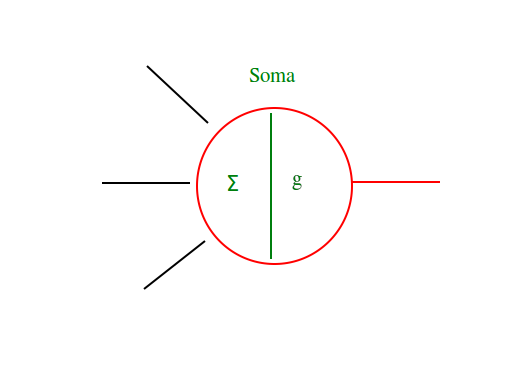
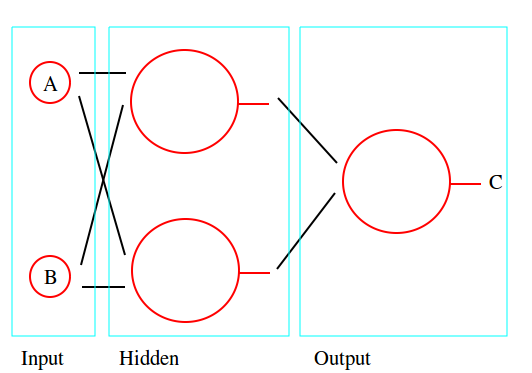
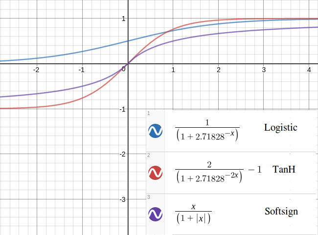

This project implements a neural network in c++, which is useful for some types of classification.

I was originally doing this in Python, while learning about making neural networks and how they
work, when it occurred to me that making this in Python was pointless because Python (although I
love that language) is unfortunately slow. So, I took this as a reason to learn c++, because a
static typed, compiled language is going to be much faster for training and classification.

###Compile

On a Linux system, do: `make` at your terminal.

My makefile is not the prettiest, but I can read it and I think it's OK for my first cpp project.

###Use

To update when I actually make the Network() class.

###Tests

After compiling, these are found in bin/tests/, and can be run as executable files.

If you're missing permissions, do `chmod +x tests/unit tests/integration`

Then, do `./bin/tests/unit` and `./bin/tests/integration`

###Discussion

To make a neural network, it's helpful to think about the different elements of actual neurons and
how those behave in actual neural networks.

Elements of (some) Neural Networks -

- Multipolar Neuron - an individual cell that communicates with other cells, with multiple
  Dendrites and multiple Axon Terminals.
- Soma - the body of the cell. This contains the nucleus and the decision process to send a signal to
other neurons.
- Axon - where a neuron outputs its own signal.
- Axon Terminal - each Axon has Terminals, which branch off (in a sense) to other Neurons' Dendrites.
- Dendrite - a neuron has many of these. Each Dendrite can be thought of as connecting to an Axon
- Terminal via a synapse.
- Synapse - the part that connects an Axon Terminal and a Dendrite.

If we think about the above information in an abstract way, then modelling a neural network allows
us to do away with some of these parts.

We need -

- Neuron - the basic element in the network. These connect to other Neurons. Has an interface and an
internal Soma.
- Soma - where incoming weights are combined and the decision to send a signal is made. Accessible to
the neuron that owns it. Sometimes the activation is a step function, but this network uses Sigmoid
functions. For now, the only option is the logistic function.
- Synapse - the elements connecting each of the neurons. These will have weights, to add meaning to
the incoming values from other Neurons. So these are what will be updated during back propagation.

Here's some pics to show how I've been reasoning about making this:

The concept of backpropagation deserves an explanation in itself, and I'll provide one. I've found
[Matt Mazur's](https://mattmazur.com/2015/03/17/a-step-by-step-backpropagation-example/) explainer
to be great, if you're prepared to step through the example step by step. This is the reason the
neurons must use a Sigmoid function. I'm not aware that backpropagation works with binary outputs.

I've chosen to use a logistic function for activating the neurons. See the [Soma::activate()](/src/assets/soma.cpp) function
for details on that. Two other functions look useful.

