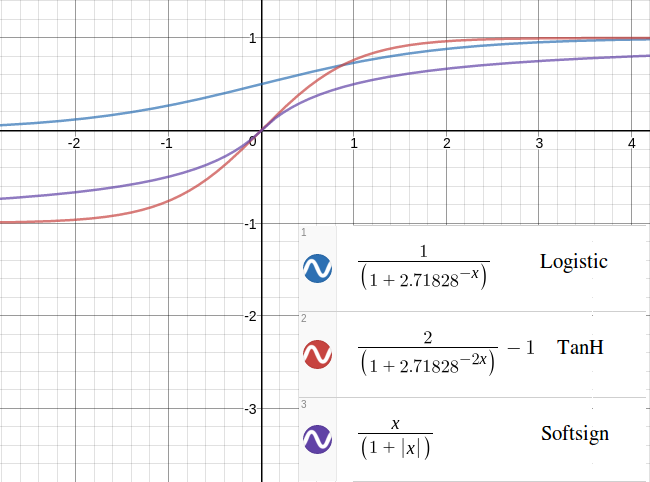

### Issues

Occasionally, a neural network's total error will grow instead of approaching zero. That is an issue
with exploding gradients, and I have no plans to fix that. If the total error during training grows
then it's best to turn it off and start again, because the ones I've let run overnight never
approach zero. This happens roughly 10-20% of all training cases. If this keeps happening, try
setting a higher `target_total_error` for the network.

An issue I've seen is that the network will take a very long time to train if the inputs are larger
than one. Increasing the number of neurons in the middle layer does seem to help. Solutions to this
are:

- Divide your inputs by a common denominator first eg: 98 and 23 becomes 98/100 = 0.98 and 23/100 =
  0.23
- Convert your numbers to binary and have more input neurons, eg: 5 becomes 1 0 1

### Discussion

This project has two classes that important for doing stuff - `Classifier` and `Trainer`. Both accept a
reference to the `Network`.

The `Network` is a container for the data model. It has internal objects like `Neurons` and `Synapses`
that do their own logic internally. The network creates layers of these smaller objects when it is
initialised.

The `Classifier` and `Trainer` classes manipulate the `Network`.

The `./bin/train` program will use the `Classifier` and `Trainer` classes, while `./bin/classify` will only
initialise and use the `Classifier` object.

I found the biological model of a neural network to be useful to some extent when doing this
project. Here are the original pics I made to help me think about it:

The `Soma` concept above I got from studying biological networks, but these functions are not internal
to `Neurons` and the `Classifier` handles everything to do with forward feed.

The concept of backpropagation deserves an explanation in itself. I've found Matt Mazur's explainer
to be great, if you're prepared to step through the example step by step. Also useful is this
article.

I've chosen to use a logistic function for activating the neurons. See the Classifier functions for
details on that. Two other functions look useful. However, it's not clear if backpropagation will
need to change if the logistic function is not used because the articles I used as references to
make the backpropagation use the logistic activation function; the learning rule uses the partial
derivative of the logistic function.

### Things to add

- Bias - a constant rate across a network, or layer, that can assist in training.
- Deep nets - this project implements a vanilla neural network of three layers, but it would be cool
to have more than one hidden layer. This is to investigate, might be unrealistic.
- Dataviz plugin - could potentially dump the output of each synapse at each epoch and then make a
dataviz. Pretty colours, straight lines, etc. Could even just make some videos for fun.
- Some analysis on how quickly different networks (size, shape, activation functions) can achieve an
acceptable total error rate, counting by epoch.
- Figure out how to mock objects so I can write actual unit tests.

Regarding the point about making the network a deep network: the data members in the Network class
for input_layer and output_layer can remain, but those will be to a layer class that's added with
composition. The layer class will have references to former and next layers, allowing for as
many hidden layers as the user wants.
