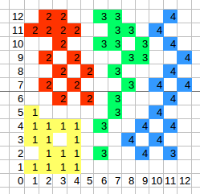
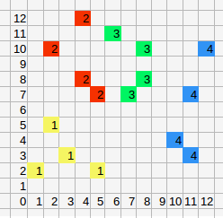

With the `./bin/train` program, you can point it at a training dataset, like this:

    ./bin/train data/training/scatter_plot.json data/networks/scatter_plot.json

The training data referenced above contains elements to make the neural network, set its training
parameters and then has an unspecified number of data for training. Those documents are training
data and training labels.

The training data is in this arrangement:

This scatter plot can be represented as a text file if the values. In order to use this training
set, the x and y values have been converted into binary representations.

So for a value of x=2 and y=12, the binary representation of this is 0,0,1,0 and 1,1,0,0. When
concatenated, these appear in the file as 0,0,1,0,1,1,0,0.

Similarly, the target labels can be represented in binary, and those three digit binary numbers are
at the end of every line in the training dataset. For example, if 2(x), 12(y) = 3, then the line for
that is `0,1,1`.

Once the training is complete and the network is saved, then do:

    ./bin/classify data/networks/scatter_plot.json data/new_data/scatter_plot.json

That file represents these unseen data:

