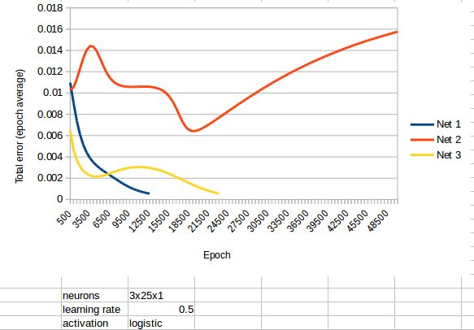

### Issues

---

Occasionally, a neural network's total error will grow instead of approaching zero. Currently I don't know
how to fix that. If the total error during training grows then it's best to turn it off and start again,
because the ones I've let run overnight never approach zero.

It's not an issue with a simple learning task, because if you see it growing you can nuke it and
start again, but more complicated tasks might be an issue.

This happens roughly 10-20% of all training cases. I've found that setting a higher `target_total_error`
for the network will mean the network is trained before this anomaly happens.

---

An issue I've seen is that the network will take a very long time to train if the input values are
larger than 1.0. Increasing the number of neurons in the middle layer does seem to help. Solutions 
to this are:

- Divide your inputs by a common denominator first eg: `98` and `23` become `98/100 = 0.98` and `23/100 =
  0.23`
- Convert your numbers to binary and have more input neurons, eg: `5` becomes `1,0,1` (4+0+1)
